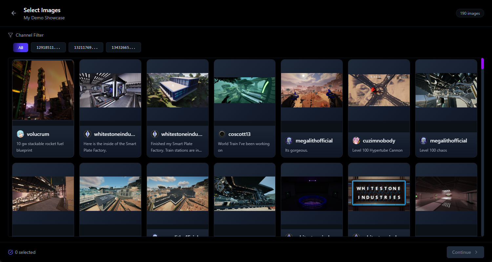

# Showcase Studio 

[](https://creativecommons.org/licenses/by/4.0/)
[](https://reactjs.org/)
[](https://www.typescriptlang.org/)
[](https://www.rust-lang.org/)

> **⚠️ Beta Status**: This application is currently in beta. It's under active development and may contain bugs or incomplete features. Feedback and contributions are welcome!

Showcase Studio is a cross-platform desktop application built with Tauri, React, and TypeScript that helps users create professional showcases and presentations from Discord messages and images.

## ✨ Screenshot Gallery

<div align="center">
  
  <p style="font-style: italic; margin-bottom: 30px">Choose images for your showcase</p>
  
  
  <p style="font-style: italic; margin-bottom: 30px">Image editor with advanced editing capabilities</p>

  
  <p style="font-style: italic; margin-bottom: 30px">Sort the list of images in your showcase</p>
  
  
  <p style="font-style: italic; margin-bottom: 30px">Generate Powerpoint Files of the presentations</p>
</div>

## 🚀 Features

- **🔗 Discord Integration**: Connect to Discord servers and fetch messages with images
- **🖼️ Image Management**: 
  - Select images from Discord messages for your showcases
  - Edit and enhance selected images with built-in image editor
  - Sort and arrange images in your desired order
- **📂 Showcase Creation**: 
  - Create and manage multiple showcases
  - Add titles, descriptions, and customize metadata
- **📊 Presentation Generation**: 
  - Export showcases as PowerPoint presentations
  - Preview showcases before exporting
- **🔒 Data Management**:
  - Secure storage of API tokens using system keyring
  - Local SQLite database for efficient data management
  - Control storage usage and data retention
- **🎨 User-Friendly Interface**:
  - Modern UI built with React and Tailwind CSS
  - Smooth animations with Framer Motion

## 🔧 Technology Stack

### 🌐 Frontend
- **⚛️ React**: UI framework
- **📘 TypeScript**: Type-safe JavaScript
- **🎨 Tailwind CSS**: Utility-first CSS framework
- **✨ Framer Motion**: Animation library
- **🧭 React Router**: Client-side routing
- **⚡ Vite**: Fast build tool and development server

### 🛠️ Backend
- **🔒 Tauri**: Framework for building desktop apps with web frontend
- **⚙️ Rust**: Systems programming language for performance-critical backend
- **💾 SQLite**: Local database for storing user data and Discord message cache
- **🔑 Keyring**: Secure storage for API tokens

## 📦 Installation

### Prerequisites
- [Node.js](https://nodejs.org/) (v18 or higher)
- [Rust](https://www.rust-lang.org/tools/install) (latest stable version)
- [VS Code](https://code.visualstudio.com/) (recommended IDE)

### Development Setup

1. **Clone the repository**
   ```bash
   git clone https://github.com/MegalithOfficial/Showcase_Studio.git
   cd Showcase_Studio
   ```

2. **Install dependencies**
   ```bash
   npm install
   ```

3. **Run in development mode**
   ```bash
   npm run tauri dev
   ```

### Building for Production

```bash
npm run tauri build
```

This will create executable files for your platform in the `src-tauri/target/release` directory.

## 📝 Usage Flow

1. **🔧 Setup**: Configure Discord API token on first launch
2. **🔍 Index Discord Content**: Select servers and channels to index
3. **🆕 Create Showcase**: Select a name and description for your new showcase
4. **🖼️ Select Images**: Browse indexed Discord messages and select images
5. **✏️ Edit Images**: Enhance selected images with the built-in editor
6. **📋 Sort Images**: Arrange images in your preferred order
7. **📤 Generate Presentation**: Export as PowerPoint or preview in the app
8. **📂 Manage Showcases**: View, edit, or delete existing showcases from the dashboard

## 👥 Contributing

Contributions are welcome! Please feel free to submit a Pull Request.

1. Fork the repository
2. Create your feature branch (`git checkout -b feature/amazing-feature`)
3. Commit your changes (`git commit -m 'Add some amazing feature'`)
4. Push to the branch (`git push origin feature/amazing-feature`)
5. Open a Pull Request

## 📜 License

This project is licensed under the MIT License - see the [LICENSE](LICENSE) file for details.

## 🙏 Acknowledgements

- [Tauri](https://tauri.app/) for providing a fantastic framework for building desktop applications
- [React](https://reactjs.org/) for the frontend UI library
- [Discord](https://discord.com/) for the API access
- All the open-source libraries that made this project possible

---

<div align="center">
  <p>Made with ❤️ by MegalithOfficial</p>
  
  [](https://github.com/MegalithOfficial/Showcase_Studio)
  [](https://github.com/MegalithOfficial)
</div>